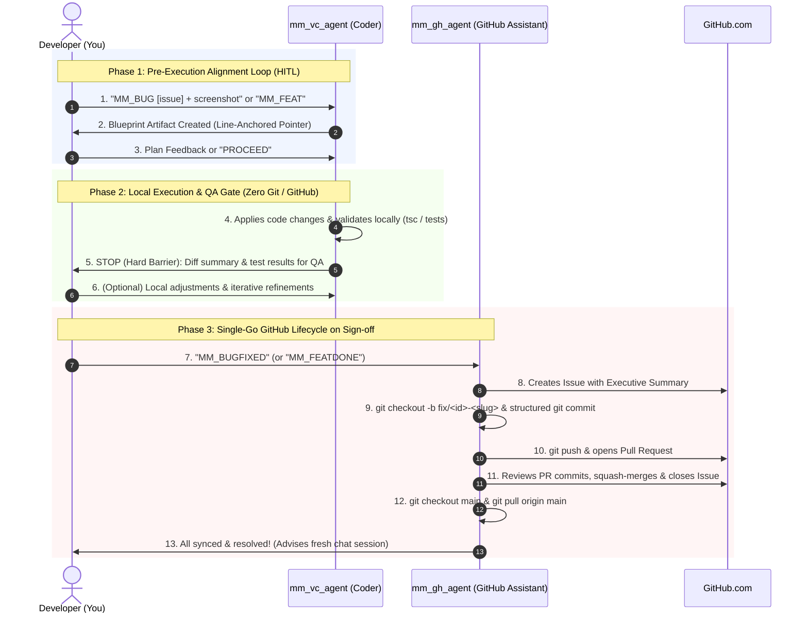

# 🚀 MM GitHub Assist (`mm_github_assist`)

> **Autonomous AI Pair Programming & GitHub Assistant for Vibe Coding**  
> _version 1.0.8_

[](LICENSE)
[]()
[](README.md)

---

## 📖 Table of Contents

1. [Overview](#overview)
2. [Multi-Developer & Team Attribution](#multi-developer--team-attribution)
3. [Prerequisites & GitHub Setup (Essential)](#prerequisites--github-setup-essential)
4. [Quick Installation & Automated Keybinding Setup (30 Seconds)](#quick-installation--automated-keybinding-setup-30-seconds)
5. [What Happens on GitHub? (The Lifecycle)](#what-happens-on-github-the-lifecycle)
6. [Complete Command & Trigger Reference](#complete-command--trigger-reference)
7. [IDE Shortcuts & Snippets Reference](#ide-shortcuts--snippets-reference)
8. [End-to-End Walkthrough Tutorial](#end-to-end-walkthrough-tutorial)
9. [Governance & Safety: `--cautious` vs `--nocautious`](#governance--safety---cautious-vs---nocautious)
10. [Team Collaboration & Best Practices](#team-collaboration--best-practices)
11. [Uninstallation & Clean Removal Guide](#uninstallation--clean-removal-guide)
12. [Troubleshooting & FAQ](#troubleshooting--faq)

---

## 1. Overview

The **MM GitHub Assist Suite** turns your AI assistant into an agile pair-programming team:

- 🧠 **`mm_vc_agent` (MM Vibe Code Agent / Architect)**: Reads your codebase, analyzes multi-modal bug screenshots, writes clean code adhering to your architecture, and verifies builds locally.
- 🐙 **`mm_gh_agent` (MM GitHub Assistant / Release Manager)**: An intelligent GitHub assistant that communicates with GitHub, opens Issues with root cause blueprints, creates feature branches, submits Pull Requests, logs iteration notes, and safely squash-merges into your main branch.

---

## 2. Multi-Developer & Team Attribution

When multiple team members (e.g., Alice, Bob, and Mustafa) use the MM Dual-Agent Suite on the same project:

- **Automatic Identity Detection**: The agent inspects the active developer's Git config (`git config user.name`) and GitHub login (`gh auth status`).
- **Attributed PRs & Comments**: Every PR description and comment is clearly branded with the developer's handle:
  `### 🤖 [mm_gh_agent for @mustafamalik] · Status Update`
- **No Collision**: Each developer gets unique branch names (`fix/142-mustafa-expense-overflow`), ensuring zero branch collisions between teammates.

---

## 3. Prerequisites & GitHub Setup (Essential)

Before using the agents, your local environment needs permissions to talk to GitHub. You have **two easy options**:

### Option A: GitHub CLI (`gh`) — _Recommended (Easiest & Safest)_

The GitHub CLI allows the agents to run securely using your local authenticated credentials without exposing tokens.

1. **Install GitHub CLI:**
   - **Windows (Winget / Chocolatey / Scoop):**
     ```powershell
     winget install --id GitHub.cli
     # or: choco install gh
     ```
   - **macOS (Homebrew):**
     ```bash
     brew install gh
     ```
   - **Linux (apt):**
     ```bash
     sudo apt install gh
     ```
2. **Reload Terminal Session (Windows Only):**

   > ⚠️ **Important on Windows:** New terminal sessions or existing windows need their `PATH` refreshed after installing `gh`. Run:

   ```powershell
   $env:Path = [System.Environment]::GetEnvironmentVariable("Path","Machine") + ";" + [System.Environment]::GetEnvironmentVariable("Path","User")
   ```

   _(Or simply close and reopen your PowerShell / IDE terminal)._

3. **Authenticate with your GitHub account:**
   ```bash
   gh auth login
   ```
   _Follow the prompts: Choose `GitHub.com` ➔ `HTTPS` or `SSH` ➔ `Login with a web browser`._
4. **Verify it works:**
   ```bash
   gh auth status
   ```
   _(You should see: `Logged in to github.com account <username>`)_

---

### Option B: Personal Access Token (Fine-Grained PAT) — _For Headless or CI Environments_

If you prefer using a token instead of the GitHub CLI:

1. Go to **GitHub Settings ➔ Developer Settings ➔ Personal Access Tokens ➔ Fine-grained tokens** (or [click here](https://github.com/settings/tokens?type=beta)).
2. Click **Generate new token**.
3. Set **Repository access**: Select `Only select repositories` and choose your project.
4. Under **Permissions**, grant:
   - **Issues**: `Read and write`
   - **Pull requests**: `Read and write`
   - **Contents**: `Read and write` (to allow branch creation and pushes)
5. Copy your token (starts with `github_pat_...`).
6. Place it in a file named `.env.mm_agent.local` in your project root:
   ```env
   GITHUB_TOKEN=github_pat_your_token_here
   ```
   _(Note: The installer automatically adds `.env.mm_agent.local` to `.gitignore` so your key is never committed)._

---

### 3.3 IDE Terminal Permissions (Granular Command Allowlist) — _Recommended for Seamless Flow_

To allow `mm_gh_agent` to manage branches, issues, and PRs without interrupting you with repetitive terminal confirmation dialogs, add these **specific 2-to-3 token command prefixes** to your IDE's auto-approved command list:

#### Specific Command Prefixes Used by the Agents:

| Category                   | Specific Command Prefix to Allow                     | Purpose                                        |
| :------------------------- | :--------------------------------------------------- | :--------------------------------------------- |
| **GitHub Issues**          | `gh issue create`, `gh issue view`, `gh issue close` | Create, read, and close issues                 |
| **GitHub Pull Requests**   | `gh pr create`, `gh pr view`, `gh pr merge`          | Open PRs, check status, and squash-merge       |
| **GitHub Auth Check**      | `gh auth status`                                     | Verify authentication                          |
| **Git Branching**          | `git checkout`, `git branch`                         | Switch/create feature branches and sync main   |
| **Git Status & Staging**   | `git status`, `git add`                              | Check workspace state and stage modified files |
| **Git Commit & Push/Pull** | `git commit`, `git push`, `git pull`                 | Create tracked commits, push PRs, pull latest  |
| **Pre-Merge Verification** | `npm run build`, `npx tsc`                           | Sanity validation before merging               |

#### How to Configure in Your IDE:

- **Google Antigravity IDE**: Go to **Settings ➔ Advanced ➔ Allow List Terminal Commands**, and enter the specific prefixes from the table above (e.g. `gh issue create`, `gh pr create`, `gh pr merge`, `git checkout`, `git commit`, `git push`, `git pull`).
- **Cursor**: Go to **Settings ➔ Features ➔ Terminal / Composer**, and add the exact prefixes above to auto-approved commands.
- **VS Code (Cline / Roo Code / Copilot)**: In extension settings under **Auto-approved terminal commands**, add the specific prefixes above.

---

## 4. Quick Installation & Automated Keybinding Setup (30 Seconds)

Run the automated installer inside any existing project workspace:

```bash
npx mm-github-assist init
```

The interactive CLI will automatically:

1. Detect your active code editor (**Antigravity, Cursor, Claude Code, VS Code, Windsurf**).
2. Validate your GitHub connection (`gh auth status`).
3. **Auto-Inject `mm_` Tagged Configs**: Injects `.vscode/mm_snippets.code-snippets`, keybindings tagged with `/* MM_KEYBINDINGS_START */`, and rules files without touching existing user configurations.
4. Provision GitHub labels (`agent-generated`, `type:bug`, `type:feature`, `status:in-progress`).

---

## 5. What Happens on GitHub? (The Lifecycle)

Here is exactly what the agents do during a task lifecycle:



### What You See on GitHub:

1. **Local Isolation During Development**: Code changes, compilations, and tests happen 100% locally in Phase 2 without generating noise, interim commits, or premature PRs on GitHub.
2. **Single-Go GitHub Automation**: Upon typing `MM_BUGFIXED` or `MM_FEATDONE`, `mm_gh_agent` executes the entire GitHub lifecycle in a single automated flow.
3. **Concise Executive Summary Issues**: An issue is opened with label `agent-generated` and title `Bug: <Summary>` (or `Feat: <Summary>`) with a clean 3-milestone executive summary.
4. **Structured Multi-Line Commits**: Commits feature a clear subject line, bulleted details of changes, and co-authorship attribution. Single-line-only commits are forbidden.
5. **Clean Pull Requests**: A PR is opened with `Closes #<id>`, reviewed, and squash-merged cleanly with remote branch cleanup.
6. **Synchronized Main Branch**: Your local workspace is checked out to `main` and pulled to latest immediately upon completion.

---

## 6. Complete Command & Trigger Reference

| Command                         | Trigger Agent                 | Purpose & What It Does                                                                                                                   | Example                                                   |
| :------------------------------ | :---------------------------- | :--------------------------------------------------------------------------------------------------------------------------------------- | :-------------------------------------------------------- |
| **`MM_ON`** / **`MM_ENABLE`**   | Suite Control                 | Activates the automated MM Dual-Agent pair programming and GitHub tracking.                                                              | `MM_ON`                                                   |
| **`MM_OFF`** / **`MM_DISABLE`** | Suite Control                 | Pauses the MM suite for standard, unconstrained AI chat without issue/PR tracking.                                                       | `MM_OFF`                                                  |
| **`MM_BUG [details]`**          | `mm_vc_agent`                 | (Phase 1) Ingests screenshots/logs, inspects code, presents root cause & blueprint. **Strictly Read-Only**.                              | `MM_BUG Tooltip gets clipped on mobile view in Analytics` |
| **`MM_FEAT [details]`**         | `mm_vc_agent`                 | (Phase 1) Analyzes architecture, plans target files & implementation blueprint. **Strictly Read-Only**.                                  | `MM_FEAT Add export CSV button with date range filter`    |
| **`PROCEED`**                   | `mm_vc_agent`                 | (Phase 2) Approves blueprint and executes code changes & tests locally ➔ **STOPS at Local QA Gate**.                                      | `PROCEED`                                                 |
| **`MM_GETISSUE`**               | `mm_gh_agent`                 | Instantly retrieves strict 4-line status card (Issue #, PR link, Phase status, active branch).                                           | `MM_GETISSUE`                                             |
| **`MM_BUGFIXED`**               | `mm_gh_agent`                 | (Phase 3) Signals QA passed for a bug. Executes full single-go GitHub lifecycle (Issue ➔ Branch ➔ Commit ➔ PR ➔ Merge ➔ Sync `main`).    | `MM_BUGFIXED` (or `MM_BUGFIXED #142`)                     |
| **`MM_FEATDONE`**               | `mm_gh_agent`                 | (Phase 3) Signals QA passed for a feature. Executes full single-go GitHub lifecycle (Issue ➔ Branch ➔ Commit ➔ PR ➔ Merge ➔ Sync `main`).| `MM_FEATDONE` (or `MM_FEATDONE #143`)                     |
| **`MM_RELEASE <version>`**       | `mm_gh_agent` / `mm_vc_agent` | (Release Phase 1 & 2) Runs pre-release gate, collision guard, code freeze, checkout `release/v<version>-(<vcode>)`, bumps version & `versioncode = current + 1`, and opens release PR `Release: v<version> (<vcode>)`. | `MM_RELEASE 1.0.5`                                        |
| **`MM_RELEASEDONE`**             | `mm_gh_agent`                 | (Release Phase 3) Merges release PR, applies dual tags (`v<version>` & `vcode-(<vcode>)`), and publishes GitHub Release `Release v<version> (<vcode>)`. | `MM_RELEASEDONE`                                          |
| **`--cautious`**                | Flag                          | Enforces confirmation prompts at key milestone transitions.                                                                              | `MM_BUG --cautious Fix chart overflow`                    |
| **`--nocautious`**              | Flag                          | Fast-tracks execution, pausing only at Initial Plan and Local QA Gate.                                                                   | `MM_BUG --nocautious Fix chart overflow`                  |

---

## 7. IDE Shortcuts & Snippets Reference

Once installed, use these built-in snippets in your IDE chat or files:

| Snippet Shortcut | Action               | What Gets Injected   |
| :--------------- | :------------------- | :------------------- |
| `mmon`           | Press <kbd>Tab</kbd> | `MM_ON`              |
| `mmoff`          | Press <kbd>Tab</kbd> | `MM_OFF`             |
| `mmbug`          | Press <kbd>Tab</kbd> | `MM_BUG: `           |
| `mmfeat`         | Press <kbd>Tab</kbd> | `MM_FEAT: `          |
| `mmgetissue`     | Press <kbd>Tab</kbd> | `MM_GETISSUE`        |
| `mmfix`          | Press <kbd>Tab</kbd> | `MM_BUGFIXED`        |
| `mmdone`         | Press <kbd>Tab</kbd> | `MM_FEATDONE`        |
| `mmrelease`      | Press <kbd>Tab</kbd> | `MM_RELEASE `        |
| `mmreleasedone`  | Press <kbd>Tab</kbd> | `MM_RELEASEDONE`     |

_(Keybindings like <kbd>Ctrl</kbd>+<kbd>Alt</kbd>+<kbd>M</kbd> are auto-configured in your IDE during installation)._

---

## 8. End-to-End Walkthrough Tutorial

### Step 1: Reporting a Bug
In your IDE chat, paste a screenshot or error and type:
```text
MM_BUG The expense breakdown chart tooltip flickers and gets cut off on mobile screens.
```
`mm_vc_agent` inspects your components, identifies the CSS/component issue, and presents an interactive **Fix Blueprint Artifact**.

### Step 2: Approving the Plan
Review the line-anchored blueprint. When aligned, reply:
```text
PROCEED
```

### Step 3: Local Implementation & Testing (Phase 2)
`mm_vc_agent` applies the fix locally and runs validation (`npx tsc --noEmit` / tests). It halts at the **Local QA Gate**:
```markdown
### 📋 Local Implementation & Validation Complete
- **Modified Files:** `src/components/AnalyticsTooltip.tsx`, `src/styles/expense-analytics.css`
- **Validation:** TypeScript 0 errors, build checks passing.
- **Ready for Review:** Test locally on http://localhost:3000 and reply `MM_BUGFIXED` when verified.
```

### Step 4: Local Testing & Iteration
You test on your local dev server (`npm run dev`). If you notice an adjustment needed:
```text
The tooltip looks great, but let's make the background slightly darker.
```
`mm_vc_agent` updates the CSS locally and re-validates, re-yielding at the Local QA Gate without touching Git or GitHub.

### Step 5: Single-Go GitHub Lifecycle & Merge (Phase 3)
Once tested and verified, type:
```text
MM_BUGFIXED
```
`mm_gh_agent` autonomously executes the entire GitHub lifecycle in a single automated chain:
1. Creates GitHub Issue `#105` with an Executive Summary.
2. Creates branch `fix/105-mustafa-chart-tooltip-flicker` and commits with a structured multi-line message.
3. Pushes branch and opens Pull Request `#106`.
4. Reviews PR commits, squash-merges PR `#106`, and closes Issue `#105`.
5. Checks out `main` and pulls latest (`git pull origin main`).
6. Confirms completion and prompts to start a fresh chat session for the next task.

---

## 9. Governance & Safety: `--cautious` vs `--nocautious`

- **`--cautious` (Default / Maximum Safety)**:
  The agents will ask for confirmation before:
  1. Modifying files in the workspace.
  2. Executing the single-go Phase 3 GitHub push and merge.
- **`--nocautious` (Fast Execution)**:
  The agents proceed directly from Plan approval (`PROCEED`) to local coding and validation, stopping only at the Local QA Gate for your manual verification.

---

## 10. Team Collaboration & Best Practices

1. **Clear Attribution**: All PRs and comments are tagged `[mm_gh_agent for @username]` or `[mm_vc_agent for @username]`, ensuring human teammates can immediately see agent contributions in the PR timeline.
2. **Never Commit Secrets**: Ensure `.env.mm_agent.local` remains in `.gitignore`.
3. **No Direct Pushes to Main**: All code must go through a branch and PR flow, preserving CI/CD integrity.
4. **Squash Merges**: Default squash-merging keeps your main branch git history clean and readable.

---

## 11. Uninstallation & Clean Removal Guide

If you ever wish to remove the MM Dual-Agent Suite from your project workspace, you can run the automated uninstaller:

```bash
npx mm-github-assist uninstall
```

### What Gets Removed (Identified by `mm_` Tags):

- ✅ Surgically strips injected MM shortcuts bounded by `/* MM_KEYBINDINGS_START */` and `/* MM_KEYBINDINGS_END */` from `.vscode/keybindings.json`.
- ✅ Deletes `.vscode/mm_snippets.code-snippets`.
- ✅ Removes all generated agent rules (`.cursor/rules/mm_dual_agent.mdc`, `.windsurfrules` MM blocks, `.agents/skills/mm_github_assist/`).
- ✅ Prompts to securely delete or archive `.env.mm_agent.local`.

### What Stays Untouched:

- 🛡️ Your source code, Git history, closed GitHub issues, and merged Pull Requests remain 100% intact and untouched.

---

## 12. Troubleshooting & FAQ

#### Q: `gh: command not found`

- **Fix**: Install GitHub CLI (`winget install GitHub.cli` or `brew install gh`), restart your terminal/IDE, and run `gh auth login`.

#### Q: `Authentication failed / Unauthorized`

- **Fix**: Run `gh auth status`. If expired, run `gh auth refresh -h github.com -s repo` or check your `GITHUB_TOKEN` in `.env.mm_agent.local`.

#### Q: `Git working tree is dirty / uncommitted changes`

- **Fix**: `mm_gh_agent` will warn you before switching branches. Stash your changes with `git stash` or commit them before starting a new `MM_BUG` or `MM_FEAT`.

#### Q: Can I use this with private repositories?

- **Yes!** As long as your GitHub account or PAT has access to the private repository, the suite operates identically.

#### Q: How do I change the default branch from `main` to `master` or `develop`?

- **Fix**: Configure `base_branch` in `.env.mm_agent.example` or pass `--base develop`.

---

## 📄 License

Released under the [MIT License](LICENSE). Built with ❤️ for the AI developer community.
