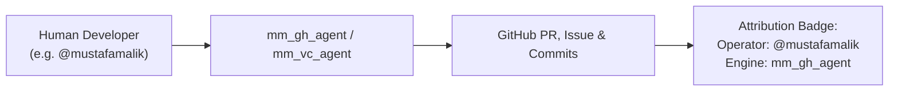
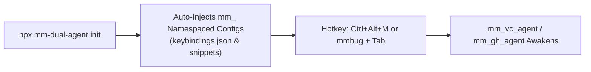
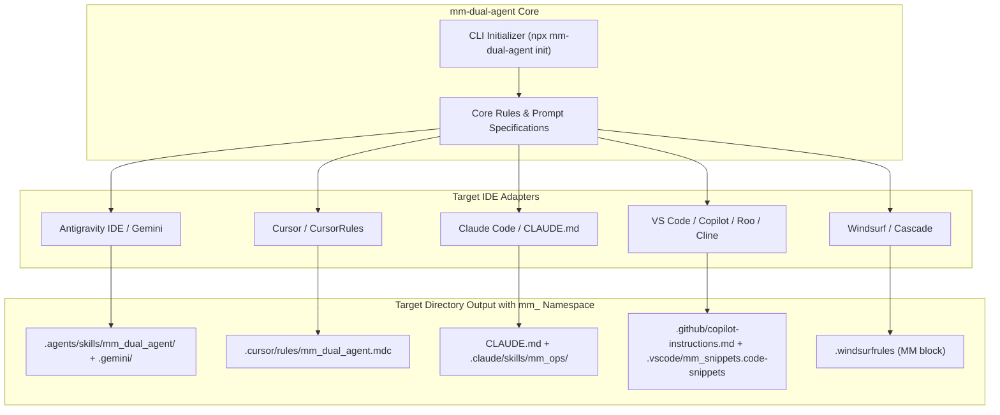
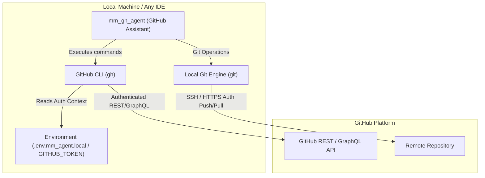
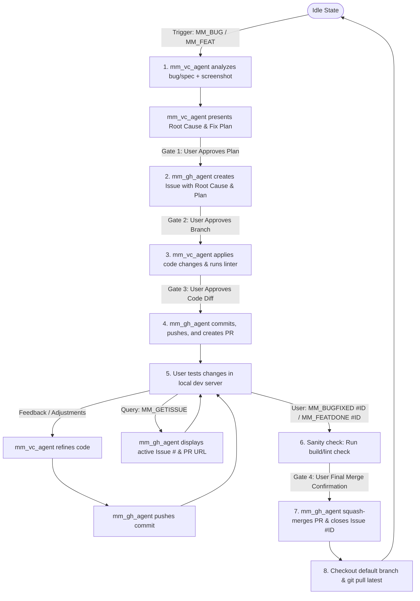
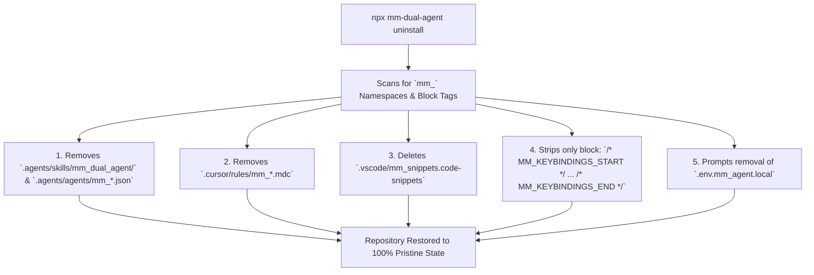
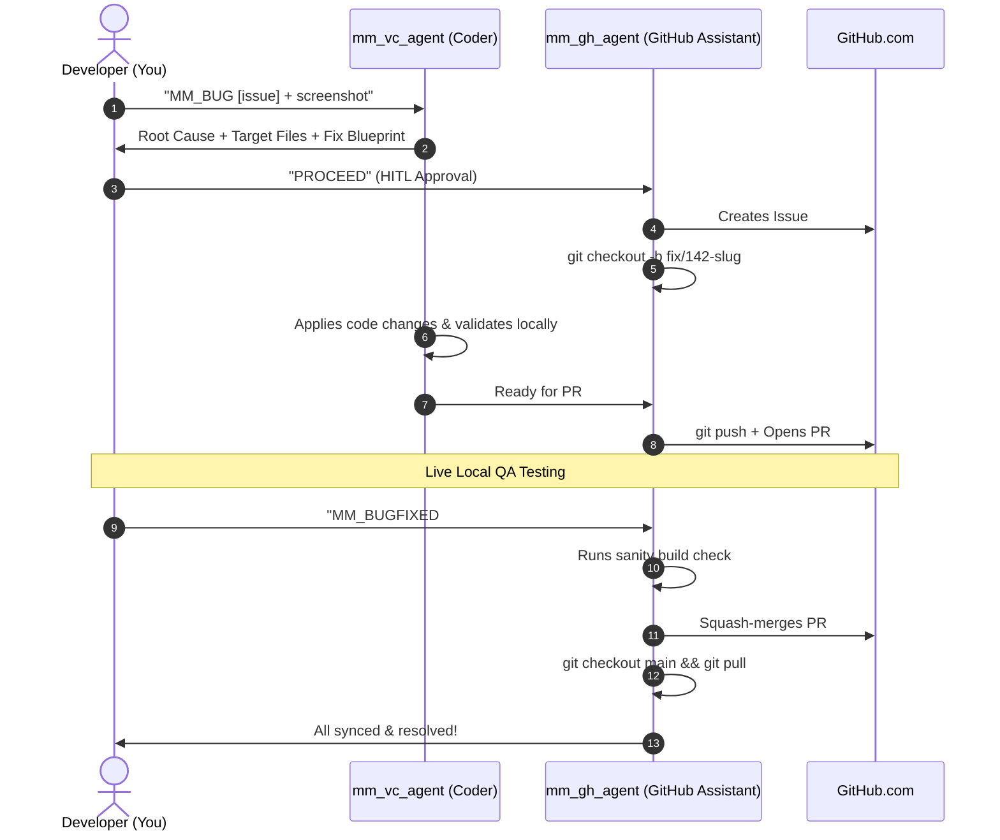

# MM Dual-Agent GitHub & Vibe-Coding Automation Specification
*(Signature Edition: `mm_vc_agent` & `mm_gh_agent` — Autonomous Vibe-Coder & GitHub Assistant)*

## 1. Executive Summary & Objectives
This specification defines the architecture, communication protocol, security model, and execution lifecycle for two collaborating MM agents:
1. **`mm_vc_agent` (MM Vibe Code Agent / Architect)**: Handles code analysis, multi-modal screenshot/error inspection, architectural planning, code modification, linting, and local verification.
2. **`mm_gh_agent` (MM GitHub Assistant / Release Manager)**: An intelligent GitHub Assistant handling all GitHub API/CLI interactions, Issue creation with embedded root cause & blueprints, Git branching, Pull Requests, automated tagging, PR reviews, and merging.

This workflow is generalized to handle **Bugs (`MM_BUG`)** and **Features/Enhancements (`MM_FEAT`)**, and is designed to be **packaged as an open-source, universal agent toolkit** installable across any IDE (**Antigravity, Cursor, Claude Code, VS Code Copilot/Cline/Roo, Windsurf**).

---

## 2. Personalized Naming, Identity & Multi-Developer Attribution

### 2.1 Multi-Developer Co-Attribution Model
When multiple team members use the MM Dual-Agent suite on the same repository, every action clearly attributes **both the human operator and the agent**:



### 2.2 Standard GitHub Attribution & Payload Headers

#### 1. GitHub Issue Body Payload (Auto-generated from Step 1 Analysis):
The entire Step 1 analysis (Root Cause, Affected Files, and Fix/Implementation Blueprint) is automatically compiled and posted as the official GitHub Issue description:

```markdown
> 🤖 **Managed by MM Automation Suite (GitHub Assistant)**
> **Operator:** `@mustafamalik` (Mustafa Malik)
> **Engineering Agent:** `mm_vc_agent` | **GitHub Assistant:** `mm_gh_agent`
> **Trigger Keyword:** `MM_BUG`

## 📋 Problem Description
Expense breakdown chart tooltip flickers and overflows container on mobile viewport (< 768px).

## 🔍 Root Cause Analysis
Container element `.expense-chart-wrapper` lacks `overflow: hidden` and relative positioning constraints, causing tooltip bounding box calculation to overflow outside the viewport.

## 🎯 Target Files
- `src-saas/components/dashboard/drilldown/ExpenseAnalyticsView.tsx`
- `src-saas/styles/expense-analytics.css`

## 🛠️ Step-by-Step Execution Plan
1. Add dedicated CSS class `.saas-analytics-chart-container` to encapsulate chart boundary.
2. Implement auto-placement boundary check for tooltip popover.
3. Validate responsive layout under mobile breakpoint emulator.
4. Run `tsc --noEmit` and repository lint checks.

---
*Created automatically by `mm_gh_agent` upon operator approval.*
```

#### 2. Progress Comment by `mm_gh_agent`:
```markdown
### 🤖 [mm_gh_agent for @mustafamalik] · Status Update
* **Iteration:** #2
* **Operator:** `@mustafamalik`
* **Action:** Applied patch for secondary edge case reported during testing.
* **Commit:** [`abc1234`](https://github.com/.../commit/abc1234)
* **Status:** Awaiting User Validation
```

#### 3. Git Commit Message & Co-Authorship:
Commits automatically record the operator as author and the agent as co-author:
```text
fix(#142): adjust chart tooltip boundary constraints

Co-authored-by: mm_vc_agent <agent@mm-automation.local>
```

### 2.3 Standard Trigger & Query Commands

| Command | Target Action | Closure / Follow-up Command |
| :--- | :--- | :--- |
| **`MM_BUG [details]`** | (Phase 1) Ingest bug description + screenshot, inspect root cause, formulate fix plan. **Strictly Read-Only**. | **`PROCEED`** |
| **`MM_FEAT [details]`** | (Phase 1) Ingest feature spec, design architecture & file breakdown. **Strictly Read-Only**. | **`PROCEED`** |
| **`PROCEED`** | (Phase 2) Authorize aligned blueprint. Provision Issue & branch, apply code edits, and open PR for live QA. | **`MM_BUGFIXED`** / **`MM_FEATDONE`** |
| **`MM_GETISSUE`** | Instantly queries and prints the currently active Issue #, PR #, active branch, and status without needing to scroll through chat history. | Returns active issue summary card & direct links |
| **`MM_BUGFIXED #<id>`** | (Phase 3) Pre-merge build sanity check, squash-merge PR, close issue, and sync workspace to latest `main`. | Workspace synced |
| **`MM_FEATDONE #<id>`** | (Phase 3) Pre-merge build sanity check, squash-merge PR, close issue, and sync workspace to latest `main`. | Workspace synced |

### 2.4 Automated IDE Keybinding & Snippet Provisioning (Zero-Touch Setup with `mm_` Tags)

During installation (`npx mm-dual-agent init`), the installer **automatically provisions and merges** the keybindings and snippets with explicit `mm_` namespaces and comment boundaries for the detected/selected IDE without overwriting existing user shortcuts:



* **Automated Injection Breakdown per IDE (All Namespaced with `mm_`):**
  - **VS Code / Antigravity / Cursor**:
    - Automatically injects `.vscode/keybindings.json` wrapped with `/* MM_KEYBINDINGS_START */` and `/* MM_KEYBINDINGS_END */`.
    - Automatically generates `.vscode/mm_snippets.code-snippets` with `mmbug`, `mmfeat`, `mmgetissue`, `mmfix`, `mmdone`.
  - **Cursor**:
    - Automatically generates `.cursor/rules/mm_dual_agent.mdc`.
  - **Claude Code**:
    - Automatically generates `.claude/skills/mm_github_ops/` and `mm_` command aliases.
  - **Windsurf**:
    - Injects into `.windsurfrules` wrapped with `<!-- MM_RULES_START -->` and `<!-- MM_RULES_END -->`.

---

## 3. Human-In-The-Loop (HITL) Governance & Flags

To balance safety and speed, the workflow supports dynamic governance flags that can be configured globally or passed inline with any command:

```mermaid
flowchart TD
    subgraph GovernanceFlags [Governance Control Flags]
        F1["Flag: --cautious (Strict Step-by-Step Approval)"]
        F2["Flag: --nocautious (Streamlined Key-Gate Mode)"]
    end

    subgraph StrictFlow [Strict Mode: --cautious]
        S1["1. mm_vc_agent: Analyze Bug/Feat"] --> Q1{"User Approve Plan?"}
        Q1 -->|Yes| S2["2. mm_gh_agent: Create Issue & Branch"]
        S2 --> Q2{"User Approve Branch & Issue #?"}
        Q2 -->|Yes| S3["3. mm_vc_agent: Apply Code Changes"]
        S3 --> Q3{"User Approve Diff & Local Tests?"}
        Q3 -->|Yes| S4["4. mm_gh_agent: Commit, Push & Create PR"]
        S4 --> Q4{"User Test & Approve in Browser?"}
        Q4 -->|Yes: MM_BUGFIXED / MM_FEATDONE| S5["5. mm_gh_agent: Run Pre-Merge Build"]
        S5 --> Q5{"User Final Confirmation to Merge?"}
        Q5 -->|Yes| S6["6. Merge PR & Sync Main Branch"]
    end
```



### 3.1 Governance Flags Definition

| Flag | Mode Name | Behavior | Ideal For |
| :--- | :--- | :--- | :--- |
| **`--cautious`** *(Default)* | **Strict HITL Mode** | Explicitly halts and asks for user confirmation at **every single transition** (Plan Approval ➔ Issue Creation ➔ Code Diff ➔ PR Creation ➔ Merge Confirmation). | New projects, onboarding, high-risk codebases, or complex architectural changes. |
| **`--nocautious`** | **Streamlined Mode** | Only pauses at essential gates: (1) Initial Plan, (2) User QA live testing, (3) Final sign-off trigger (`MM_BUGFIXED` / `MM_FEATDONE`). Auto-executes intermediate steps. | Fast day-to-day bug fixes, trusted workflows, and routine enhancements. |

### 3.2 Inline Usage Examples
- `MM_BUG --cautious Fix chart overflow in ExpenseAnalytics` (Forces step-by-step confirmation)
- `MM_BUG --nocautious Update button color to indigo` (Fast-tracks directly to PR for testing)
- `MM_FEAT --cautious Add export CSV button with background queue`

---

## 4. Universal IDE & Vibe-Coding Platform Compatibility



---

## 5. GitHub Access & Security Architecture

### 5.1 Access Mechanisms


* **Tier 1: GitHub CLI (`gh auth`) (Recommended)**: Leverages native interactive login (`gh auth status`). Safest, zero secret leakage.
* **Tier 2: Fine-Grained PAT (`GITHUB_TOKEN`)**: Loaded via `.env.mm_agent.local` (strictly excluded in `.gitignore`).

---

## 6. Detailed Step-by-Step Execution Protocol



### Step 1: Ingestion & Analysis (`mm_vc_agent`)
- Triggered by `MM_BUG` or `MM_FEAT`.
- Detects the active developer identity from `git config user.name` / `gh api user`.
- Analyzes screenshots, error logs, and repository code.
- Produces **Root Cause Analysis**, **Affected Target Files**, and **Step-by-step Fix/Implementation Blueprint**.
- **HITL Prompt**: *"Do you approve this plan to proceed with creating Issue & Branch? (Yes/Adjust)"*

### Step 2: Issue & Branch Provisioning (`mm_gh_agent`)
- Upon approval, runs `gh issue create`, **automatically injecting the full Root Cause, Target Files list, and Execution Plan** into the GitHub Issue body (as shown in Section 2.2).
- Pins Issue ID:
  > 📌 **Created Issue #142:** `https://github.com/org/repo/issues/142`  
  > 👤 **Operator:** `@mustafamalik`  
  > 🌿 **Active Branch:** `fix/142-expense-tooltip-overflow`  
  > 💡 *Reference this issue with `MM_BUGFIXED #142` or `MM_FEATDONE #142`.*
- Checks out new branch.

### Step 3: Code Implementation & Local Validation (`mm_vc_agent`)
- Implements modifications following project architectural rules.
- Runs local typecheck and linting.

### Step 4: PR Creation & Live Testing (`mm_gh_agent`)
- Commits and pushes branch to remote with operator metadata.
- Opens Pull Request linked to Issue (`Closes #142`), including the plan and changelog in the PR description.
- Prompts user to perform live testing on their local dev server.

### Step 5: Active Issue Querying (`MM_GETISSUE`)
- If the chat conversation grows long and the user needs to check the issue number or branch:
  - User types `MM_GETISSUE` (or snippet `mmgetissue` + <kbd>Tab</kbd>).
  - `mm_gh_agent` immediately responds:
    > 🔍 **Active Work Context:**  
    > • **Operator:** `@mustafamalik`  
    > • **Issue:** `#142` — *[BUG] ExpenseAnalytics chart tooltip overflow*  
    > • **PR:** `#143` (`https://github.com/org/repo/pull/143`)  
    > • **Branch:** `fix/142-expense-tooltip-overflow`  
    > • **Status:** `In Review / Testing`  
    > • **To Close & Merge:** Reply with `MM_BUGFIXED #142`

### Step 6: Final Sign-off & Merge (`mm_gh_agent`)
- Triggered by `MM_BUGFIXED #142` or `MM_FEATDONE #142`.
- `mm_gh_agent` performs pre-merge sanity check (`npm run build` / `tsc`).
- Upon confirmation: Squash-merges PR, closes Issue, switches back to base branch, and runs `git pull`.

---

## 7. Reusable Open-Source Distribution & Surgical Uninstall Architecture

### 7.1 Repository Structure (`mm-dual-agent`)
```text
mm-dual-agent/
├── README.md                      # Complete User Manual & Documentation
├── LICENSE                        # MIT License
├── package.json                   # Interactive CLI installer & uninstaller
├── bin/
│   └── mm-agent.js                # CLI entry point (init & uninstall)
├── adapters/
│   ├── antigravity.js             # Generates & cleans .agents/skills/mm_dual_agent/
│   ├── cursor.js                  # Generates & cleans .cursor/rules/mm_dual_agent.mdc
│   ├── claude.js                  # Generates & cleans CLAUDE.md and .claude/skills/mm_ops/
│   ├── vscode.js                  # Injects & surgically removes .vscode/mm_snippets.code-snippets
│   └── windsurf.js                # Generates & cleans .windsurfrules (MM blocks)
├── snippets/
│   └── mm_snippets.json           # Ready-to-use IDE snippets (mmbug, mmfix, mmfeat, mmdone, mmgetissue)
└── rules/
    ├── mm_vc_agent.md             # MM Engineering rules
    └── mm_gh_agent.md             # MM GitHub Assistant rules
```

### 7.2 Explicit `mm_` Tagging Strategy for Pristine Teardowns
Every installed artifact is systematically prefixed and tagged with `mm_` to guarantee that uninstallation is 100% deterministic and never accidentally touches other project configurations:



#### Complete Namespace Mapping Table:
| Component | Installation Path with `mm_` Tag | Teardown Action |
| :--- | :--- | :--- |
| **Antigravity Skills** | `.agents/skills/mm_dual_agent/` | Deleted directory |
| **Antigravity Agents** | `.agents/agents/mm_vc_agent.json`, `mm_gh_agent.json` | Deleted files |
| **Cursor Rules** | `.cursor/rules/mm_dual_agent.mdc` | Deleted file |
| **Claude Skills** | `.claude/skills/mm_github_ops/` | Deleted directory |
| **VS Code Snippets** | `.vscode/mm_snippets.code-snippets` | Deleted file |
| **VS Code Keybindings** | Injected block between `/* MM_KEYBINDINGS_START */` and `/* MM_KEYBINDINGS_END */` in `.vscode/keybindings.json` | Surgically removed block |
| **Windsurf Rules** | Injected block between `<!-- MM_RULES_START -->` and `<!-- MM_RULES_END -->` in `.windsurfrules` | Surgically removed block |
| **Environment File** | `.env.mm_agent.local` | Prompted deletion / archive |

---

## 8. Complete User Manual & Open-Source `README.md` Specification

This section serves as the complete, authoritative User Manual included directly in the root `README.md` of the open-source repository.

```markdown
# 🚀 MM Dual-Agent Suite
> **Autonomous AI Pair Programming & GitHub Assistant for Vibe Coding**  
> *Crafted by Mustafa Malik (MM)*

[](LICENSE)
[]()
[](README.md)

---

## 📖 Table of Contents
1. [Overview & The MM Duo](#overview--the-mm-duo)
2. [Multi-Developer & Team Attribution](#multi-developer--team-attribution)
3. [Prerequisites & GitHub Setup (Essential)](#prerequisites--github-setup-essential)
4. [Quick Installation & Automated Keybinding Setup (30 Seconds)](#quick-installation--automated-keybinding-setup-30-seconds)
5. [What Happens on GitHub? (The Lifecycle)](#what-happens-on-github-the-lifecycle)
6. [Complete Command & Trigger Reference](#complete-command--trigger-reference)
7. [IDE Shortcuts & Snippets Reference](#ide-shortcuts--snippets-reference)
8. [End-to-End Walkthrough Tutorial](#end-to-end-walkthrough-tutorial)
9. [Governance & Safety: `--cautious` vs `--nocautious`](#governance--safety---cautious-vs---nocautious)
10. [Team Collaboration & Best Practices](#team-collaboration--best-practices)
11. [Uninstallation & Clean Removal Guide](#uninstallation--clean-removal-guide)
12. [Troubleshooting & FAQ](#troubleshooting--faq)

---

## 1. Overview & The MM Duo

The **MM Dual-Agent Suite** turns your AI assistant into an agile pair-programming team:

* 🧠 **`mm_vc_agent` (MM Vibe Code Agent / Architect)**: Reads your codebase, analyzes multi-modal bug screenshots, writes clean code adhering to your architecture, and verifies builds locally.
* 🐙 **`mm_gh_agent` (MM GitHub Assistant / Release Manager)**: An intelligent GitHub assistant that communicates with GitHub, opens Issues with root cause blueprints, creates feature branches, submits Pull Requests, logs iteration notes, and safely squash-merges into your main branch.

---

## 2. Multi-Developer & Team Attribution

When multiple team members (e.g., Alice, Bob, and Mustafa) use the MM Dual-Agent Suite on the same project:
* **Automatic Identity Detection**: The agent inspects the active developer's Git config (`git config user.name`) and GitHub login (`gh auth status`).
* **Attributed PRs & Comments**: Every PR description and comment is clearly branded with the developer's handle:
  `### 🤖 [mm_gh_agent for @mustafamalik] · Status Update`
* **No Collision**: Each developer gets unique branch names (`fix/142-mustafa-expense-overflow`), ensuring zero branch collisions between teammates.

---

## 3. Prerequisites & GitHub Setup (Essential)

Before using the agents, your local environment needs permissions to talk to GitHub. You have **two easy options**:

### Option A: GitHub CLI (`gh`) — *Recommended (Easiest & Safest)*
The GitHub CLI allows the agents to run securely using your local authenticated credentials without exposing tokens.

1. **Install GitHub CLI:**
   - **Windows (Winget / Chocolatey / Scoop):**
     ```powershell
     winget install --id GitHub.cli
     # or: choco install gh
     ```
   - **macOS (Homebrew):**
     ```bash
     brew install gh
     ```
   - **Linux (apt):**
     ```bash
     sudo apt install gh
     ```
2. **Authenticate with your GitHub account:**
   ```bash
   gh auth login
   ```
   *Follow the prompts: Choose `GitHub.com` ➔ `HTTPS` or `SSH` ➔ `Login with a web browser`.*
3. **Verify it works:**
   ```bash
   gh auth status
   ```
   *(You should see: `Logged in to github.com account <username>`)*

---

### Option B: Personal Access Token (Fine-Grained PAT) — *For Headless or CI Environments*
If you prefer using a token instead of the GitHub CLI:

1. Go to **GitHub Settings ➔ Developer Settings ➔ Personal Access Tokens ➔ Fine-grained tokens** (or [click here](https://github.com/settings/tokens?type=beta)).
2. Click **Generate new token**.
3. Set **Repository access**: Select `Only select repositories` and choose your project.
4. Under **Permissions**, grant:
   - **Issues**: `Read and write`
   - **Pull requests**: `Read and write`
   - **Contents**: `Read and write` (to allow branch creation and pushes)
5. Copy your token (starts with `github_pat_...`).
6. Place it in a file named `.env.mm_agent.local` in your project root:
   ```env
   GITHUB_TOKEN=github_pat_your_token_here
   ```
   *(Note: The installer automatically adds `.env.mm_agent.local` to `.gitignore` so your key is never committed).*

---

## 4. Quick Installation & Automated Keybinding Setup (30 Seconds)

Run the automated installer inside any existing project workspace:

```bash
npx mm-dual-agent init
```

The interactive CLI will automatically:
1. Detect your active code editor (**Antigravity, Cursor, Claude Code, VS Code, Windsurf**).
2. Validate your GitHub connection (`gh auth status`).
3. **Auto-Inject `mm_` Tagged Configs**: Injects `.vscode/mm_snippets.code-snippets`, keybindings tagged with `/* MM_KEYBINDINGS_START */`, and rules files without touching existing user configurations.
4. Provision GitHub labels (`agent-generated`, `type:bug`, `type:feature`, `status:in-progress`).

---

## 5. What Happens on GitHub? (The Lifecycle)

Here is exactly what the agents do on your GitHub repository during a task:



### What You See on GitHub:
1. **GitHub Issues**: An issue is opened with label `agent-generated` and title `[BUG] <Summary>`. **The body contains the complete Root Cause Analysis, list of Target Files, and Step-by-Step Blueprint.**
2. **GitHub Branches**: A clean branch `fix/<issue-id>-<operator>-<slug>` is created.
3. **GitHub Pull Requests**: A PR is opened with a description linking `Closes #<id>`, showing full diffs and changelogs.
4. **Issue / PR Comments**: Every iteration note is logged with badge `### 🤖 [mm_gh_agent for @username] · Status Update`.
5. **Clean Merges**: On sign-off, PR is squash-merged, remote branch is deleted, and your local workspace is updated.

---

## 6. Complete Command & Trigger Reference

| Command | Trigger Agent | Purpose & What It Does | Example |
| :--- | :--- | :--- | :--- |
| **`MM_BUG [details]`** | `mm_vc_agent` | Starts bug investigation. Ingests screenshots/logs, inspects code, and presents root cause & fix plan. | `MM_BUG Tooltip gets clipped on mobile view in Analytics` |
| **`MM_FEAT [details]`** | `mm_vc_agent` | Starts feature/enhancement flow. Analyzes architecture, plans new files, and outlines implementation. | `MM_FEAT Add export CSV button with date range filter` |
| **`MM_GETISSUE`** | `mm_gh_agent` | Instantly retrieves active Issue #, PR link, active branch, and status if chat is long. | `MM_GETISSUE` |
| **`MM_BUGFIXED #<id>`** | `mm_gh_agent` | Signals QA passed for a bug. Runs pre-merge build checks, squash-merges PR, closes issue, and pulls `main`. | `MM_BUGFIXED #142` (or `MM_BUGFIXED`) |
| **`MM_FEATDONE #<id>`** | `mm_gh_agent` | Signals QA passed for a feature. Verifies build, squash-merges PR, closes issue, and syncs branch. | `MM_FEATDONE #143` (or `MM_FEATDONE`) |
| **`--cautious`** | Flag | Enforces strict confirmation at every individual transition step. | `MM_BUG --cautious Fix chart overflow` |
| **`--nocautious`** | Flag | Fast-tracks execution, pausing only at Initial Plan and Final QA. | `MM_BUG --nocautious Fix chart overflow` |

---

## 7. IDE Shortcuts & Snippets Reference

Once installed, use these built-in snippets in your IDE chat or files:

| Snippet Shortcut | Action | What Gets Injected |
| :--- | :--- | :--- |
| `mmbug` | Press <kbd>Tab</kbd> | `MM_BUG: ` |
| `mmfeat` | Press <kbd>Tab</kbd> | `MM_FEAT: ` |
| `mmgetissue` | Press <kbd>Tab</kbd> | `MM_GETISSUE` |
| `mmfix` | Press <kbd>Tab</kbd> | `MM_BUGFIXED #` |
| `mmdone` | Press <kbd>Tab</kbd> | `MM_FEATDONE #` |

*(Keybindings like <kbd>Ctrl</kbd>+<kbd>Alt</kbd>+<kbd>M</kbd> are auto-configured in your IDE during installation).*

---

## 8. End-to-End Walkthrough Tutorial

### Step 1: Reporting a Bug
In your IDE chat, paste a screenshot or error and type:
```text
MM_BUG The expense breakdown chart tooltip flickers and gets cut off on mobile screens.
```
`mm_vc_agent` will inspect your components, identify the CSS / component issue, and present a **Fix Plan with Root Cause and Target Files**.

### Step 2: Approving the Plan
You reply:
```text
PROCEED
```
`mm_gh_agent` creates **GitHub Issue #105** (posting the complete Root Cause Analysis and Blueprint in the description) and switches to branch `fix/105-mustafa-chart-tooltip-flicker`.

### Step 3: Coding & PR Creation
`mm_vc_agent` writes the fix and verifies the build. `mm_gh_agent` commits, pushes, and creates **Pull Request #106**.

### Step 4: Testing & Iteration
You test on your local dev server (`npm run dev`). If you notice something minor:
```text
The tooltip looks great, but let's make the background slightly darker.
```
`mm_vc_agent` adjusts the color, and `mm_gh_agent` pushes an update commit.

### Step 5: Getting Context in Long Chats
If you've had a long conversation and forgot the issue number:
```text
MM_GETISSUE
```
`mm_gh_agent` prints the active Issue `#105` and PR `#106` summary card with operator attribution.

### Step 6: Closing & Merging
Once tested and verified, type:
```text
MM_BUGFIXED #105
```
`mm_gh_agent` runs a pre-merge sanity check, squash-merges PR `#106`, closes Issue `#105`, checks out `main`, and runs `git pull`.

---

## 9. Governance & Safety: `--cautious` vs `--nocautious`

* **`--cautious` (Default / Maximum Safety)**:
  The agents will ask for your explicit confirmation before:
  1. Creating an Issue and Branch on GitHub.
  2. Modifying files in the workspace.
  3. Pushing code and opening a PR.
  4. Merging the PR to main.
* **`--nocautious` (Fast Execution)**:
  The agents will proceed autonomously from Plan approval directly to PR creation, stopping only when ready for your local manual testing.

---

## 10. Team Collaboration & Best Practices

1. **Clear Attribution**: All PRs and comments are tagged `[mm_gh_agent for @username]` or `[mm_vc_agent for @username]`, ensuring human teammates can immediately see agent contributions in the PR timeline.
2. **Never Commit Secrets**: Ensure `.env.mm_agent.local` remains in `.gitignore`.
3. **No Direct Pushes to Main**: All code must go through a branch and PR flow, preserving CI/CD integrity.
4. **Squash Merges**: Default squash-merging keeps your main branch git history clean and readable.

---

## 11. Uninstallation & Clean Removal Guide

If you ever wish to remove the MM Dual-Agent Suite from your project workspace, you can run the automated uninstaller:

```bash
npx mm-dual-agent uninstall
```

### What Gets Removed (Identified by `mm_` Tags):
* ✅ Surgically strips injected MM shortcuts bounded by `/* MM_KEYBINDINGS_START */` and `/* MM_KEYBINDINGS_END */` from `.vscode/keybindings.json`.
* ✅ Deletes `.vscode/mm_snippets.code-snippets`.
* ✅ Removes all generated agent rules (`.cursor/rules/mm_dual_agent.mdc`, `.windsurfrules` MM blocks, `.agents/skills/mm_dual_agent/`).
* ✅ Prompts to securely delete or archive `.env.mm_agent.local`.

### What Stays Untouched:
* 🛡️ Your source code, Git history, closed GitHub issues, and merged Pull Requests remain 100% intact and untouched.

---

## 12. Troubleshooting & FAQ

#### Q: `gh: command not found`
* **Fix**: Install GitHub CLI (`winget install GitHub.cli` or `brew install gh`), restart your terminal/IDE, and run `gh auth login`.

#### Q: `Authentication failed / Unauthorized`
* **Fix**: Run `gh auth status`. If expired, run `gh auth refresh -h github.com -s repo` or check your `GITHUB_TOKEN` in `.env.mm_agent.local`.

#### Q: `Git working tree is dirty / uncommitted changes`
* **Fix**: `mm_gh_agent` will warn you before switching branches. Stash your changes with `git stash` or commit them before starting a new `MM_BUG` or `MM_FEAT`.

#### Q: Can I use this with private repositories?
* **Yes!** As long as your GitHub account or PAT has access to the private repository, the suite operates identically.

#### Q: How do I change the default branch from `main` to `master` or `develop`?
* **Fix**: Configure `base_branch` in `.agents/config.json` or pass `--base develop`.

---

## 📄 License
Released under the [MIT License](LICENSE). Built with ❤️ for the AI developer community.
```
