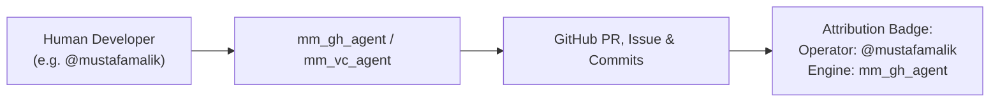
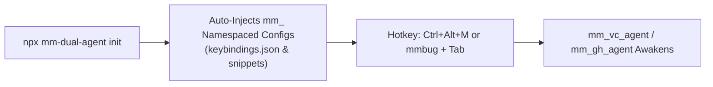
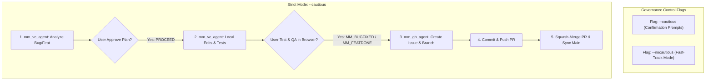
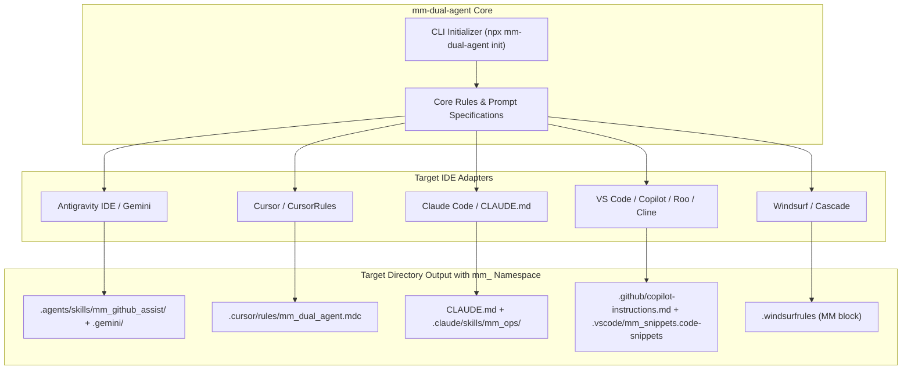
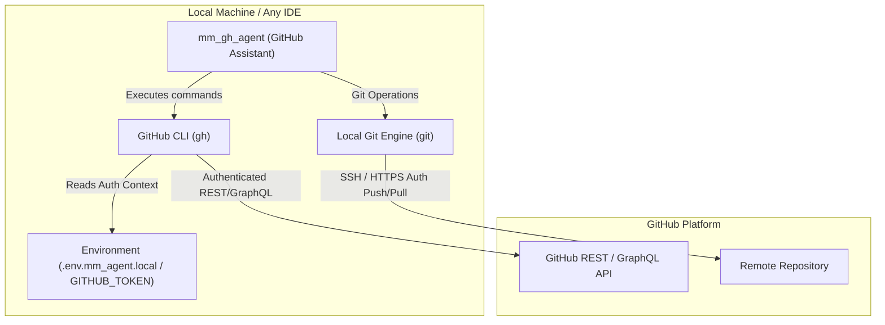
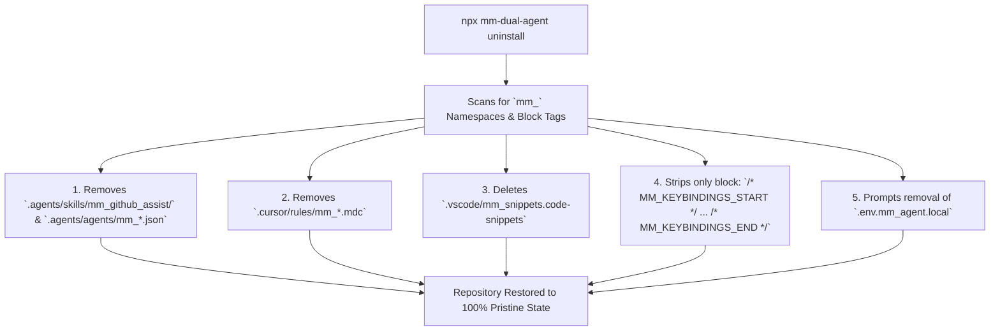
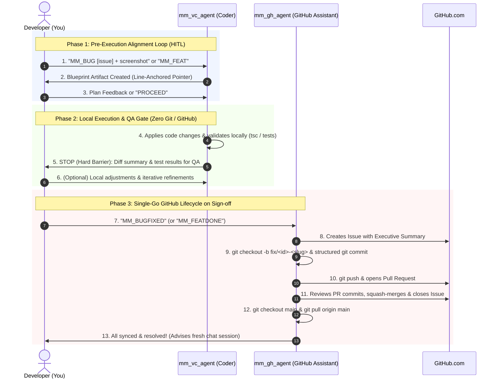

# MM Dual-Agent GitHub & Vibe-Coding Automation Specification

_(Signature Edition: `mm_vc_agent` & `mm_gh_agent` — Autonomous Vibe-Coder & GitHub Assistant)_

## 1. Executive Summary & Objectives

This specification defines the architecture, communication protocol, security model, and execution lifecycle for two collaborating MM agents:

1. **`mm_vc_agent` (MM Vibe Code Agent / Architect)**: Handles code analysis, multi-modal screenshot/error inspection, architectural planning, code modification, linting, and local verification.
2. **`mm_gh_agent` (MM GitHub Assistant / Release Manager)**: An intelligent GitHub Assistant handling all GitHub API/CLI interactions, Issue creation with embedded root cause & blueprints, Git branching, Pull Requests, automated tagging, PR reviews, and merging.

This workflow is generalized to handle **Bugs (`MM_BUG`)** and **Features/Enhancements (`MM_FEAT`)**, and is designed to be **packaged as an open-source, universal agent toolkit** installable across any IDE (**Antigravity, Cursor, Claude Code, VS Code Copilot/Cline/Roo, Windsurf**).

---

## 2. Personalized Naming, Identity & Multi-Developer Attribution

### 2.1 Multi-Developer Co-Attribution Model

When multiple team members use the MM Dual-Agent suite on the same repository, every action clearly attributes **both the human operator and the agent**:


```mermaid
flowchart LR
    Dev["Human Developer<br>(e.g. @mustafamalik)"] --> Agent["mm_gh_agent / mm_vc_agent"]
    Agent --> Remote["GitHub PR, Issue & Commits"]
    Remote --> AuditLog["Attribution Badge:<br>Operator: @mustafamalik<br>Engine: mm_gh_agent"]
```

### 2.2 Standard GitHub Attribution & Payload Headers

#### 1. GitHub Issue Body Payload (Auto-generated from Step 1 Analysis):

The entire Step 1 analysis (Root Cause, Affected Files, and Fix/Implementation Blueprint) is automatically compiled and posted as the official GitHub Issue description:

```markdown
> 🤖 **Managed by MM Automation Suite (GitHub Assistant)**
> **Operator:** `@mustafamalik` (Mustafa Malik)
> **Engineering Agent:** `mm_vc_agent` | **GitHub Assistant:** `mm_gh_agent`
> **Trigger Keyword:** `MM_BUG`

## 📋 Problem Description

Expense breakdown chart tooltip flickers and overflows container on mobile viewport (< 768px).

## 🔍 Root Cause Analysis

Container element `.expense-chart-wrapper` lacks `overflow: hidden` and relative positioning constraints, causing tooltip bounding box calculation to overflow outside the viewport.

## 🎯 Target Files

- `src-saas/components/dashboard/drilldown/ExpenseAnalyticsView.tsx`
- `src-saas/styles/expense-analytics.css`

## 🛠️ Step-by-Step Execution Plan

1. Add dedicated CSS class `.saas-analytics-chart-container` to encapsulate chart boundary.
2. Implement auto-placement boundary check for tooltip popover.
3. Validate responsive layout under mobile breakpoint emulator.
4. Run `tsc --noEmit` and repository lint checks.

---

_Created automatically by `mm_gh_agent` upon operator approval._
```

#### 2. Progress Comment by `mm_gh_agent`:

```markdown
### 🤖 [mm_gh_agent for @mustafamalik] · Status Update

- **Iteration:** #2
- **Operator:** `@mustafamalik`
- **Action:** Applied patch for secondary edge case reported during testing.
- **Commit:** [`abc1234`](https://github.com/.../commit/abc1234)
- **Summary of Changes:**
  - Recalibrated boundary offsets to prevent clipping on mobile viewports
  - Added test case verifying multi-series chart rendering
- **Status:** Awaiting User Validation
```

#### 3. Multi-line Git Commit Message & Co-Authorship:

Commits automatically record a descriptive subject, a bulleted summary of changes in the body, and co-authorship attribution:

```text
fix(#142): adjust chart tooltip boundary constraints

- Recalibrated boundary offsets to prevent tooltip clipping on viewport edges
- Added event listeners for window resize to trigger recalculation

Co-authored-by: mm_vc_agent <agent@mm-automation.local>
```

### 2.3 Standard Trigger & Query Commands

| Command                 | Target Action                                                                                                                              | Closure / Follow-up Command                      |
| :---------------------- | :----------------------------------------------------------------------------------------------------------------------------------------- | :----------------------------------------------- |
| **`MM_BUG [details]`**  | (Phase 1) Ingest bug description + screenshot, inspect root cause, formulate fix plan. **Strictly Read-Only**.                             | **`PROCEED`**                                    |
| **`MM_FEAT [details]`** | (Phase 1) Ingest feature spec, design architecture & file breakdown. **Strictly Read-Only**.                                               | **`PROCEED`**                                    |
| **`PROCEED`**           | (Phase 2) Authorize aligned blueprint. Execute code edits locally and validate ➔ **STOP at Local QA Gate**.                                 | **`MM_BUGFIXED`** / **`MM_FEATDONE`**            |
| **`MM_GETISSUE`**       | Instantly queries and prints the currently active Issue #, PR #, active branch, and status without needing to scroll through chat history. | Returns active issue summary card & direct links |
| **`MM_BUGFIXED`**       | (Phase 3) Execute single-go GitHub lifecycle (Issue ➔ Branch ➔ Commit ➔ PR ➔ Merge ➔ Sync `main`).                                         | Workspace synced                                 |
| **`MM_FEATDONE`**       | (Phase 3) Execute single-go GitHub lifecycle (Issue ➔ Branch ➔ Commit ➔ PR ➔ Merge ➔ Sync `main`).                                         | Workspace synced                                 |

### 2.4 Automated IDE Keybinding & Snippet Provisioning (Zero-Touch Setup with `mm_` Tags)

During installation (`npx mm-dual-agent init`), the installer **automatically provisions and merges** the keybindings and snippets with explicit `mm_` namespaces and comment boundaries for the detected/selected IDE without overwriting existing user shortcuts:


```mermaid
flowchart LR
    Installer["npx mm-dual-agent init"] --> AutoInject["Auto-Injects mm_ Namespaced Configs<br>(keybindings.json & snippets)"]
    AutoInject --> UserTrigger["Hotkey: Ctrl+Alt+M or mmbug + Tab"]
    UserTrigger --> AgentInvocation["mm_vc_agent / mm_gh_agent Awakens"]
```

- **Automated Injection Breakdown per IDE (All Namespaced with `mm_`):**
  - **VS Code / Antigravity / Cursor**:
    - Automatically injects `.vscode/keybindings.json` wrapped with `/* MM_KEYBINDINGS_START */` and `/* MM_KEYBINDINGS_END */`.
    - Automatically generates `.vscode/mm_snippets.code-snippets` with `mmbug`, `mmfeat`, `mmgetissue`, `mmfix`, `mmdone`.
  - **Cursor**:
    - Automatically generates `.cursor/rules/mm_dual_agent.mdc`.
  - **Claude Code**:
    - Automatically generates `.claude/skills/mm_github_ops/` and `mm_` command aliases.
  - **Windsurf**:
    - Injects into `.windsurfrules` wrapped with `<!-- MM_RULES_START -->` and `<!-- MM_RULES_END -->`.

---

## 3. Human-In-The-Loop (HITL) Governance & Flags

To balance safety and speed, the workflow supports dynamic governance flags that can be configured globally or passed inline with any command:


```mermaid
flowchart TD
    subgraph GovernanceFlags [Governance Control Flags]
        F1["Flag: --cautious (Confirmation Prompts)"]
        F2["Flag: --nocautious (Fast-Track Mode)"]
    end

    subgraph StrictFlow [Strict Mode: --cautious]
        S1["1. mm_vc_agent: Analyze Bug/Feat"] --> Q1{"User Approve Plan?"}
        Q1 -->|Yes: PROCEED| S2["2. mm_vc_agent: Local Edits & Tests"]
        S2 --> Q2{"User Test & QA in Browser?"}
        Q2 -->|Yes: MM_BUGFIXED / MM_FEATDONE| S3["3. mm_gh_agent: Create Issue & Branch"]
        S3 --> S4["4. Commit & Push PR"]
        S4 --> S5["5. Squash-Merge PR & Sync Main"]
    end
```

### 3.1 Governance Flags Definition

| Flag                         | Mode Name            | Behavior                                                                                                                                                                  | Ideal For                                                                        |
| :--------------------------- | :------------------- | :------------------------------------------------------------------------------------------------------------------------------------------------------------------------ | :------------------------------------------------------------------------------- |
| **`--cautious`** _(Default)_ | **Strict HITL Mode** | Explicitly halts and asks for user confirmation at key milestone transitions (Plan Approval ➔ Local Edits ➔ Phase 3 GitHub push and merge).                               | New projects, onboarding, high-risk codebases, or complex architectural changes. |
| **`--nocautious`**           | **Streamlined Mode** | Only pauses at essential gates: (1) Initial Plan, (2) User Local QA Gate, (3) Final sign-off trigger (`MM_BUGFIXED` / `MM_FEATDONE`). Auto-executes intermediate steps. | Fast day-to-day bug fixes, trusted workflows, and routine enhancements.          |

### 3.2 Inline Usage Examples

- `MM_BUG --cautious Fix chart overflow in ExpenseAnalytics` (Forces step-by-step confirmation)
- `MM_BUG --nocautious Update button color to indigo` (Fast-tracks directly to Local QA Gate)
- `MM_FEAT --cautious Add export CSV button with background queue`

---

## 4. Universal IDE & Vibe-Coding Platform Compatibility


```mermaid
flowchart TD
    subgraph Core Toolkit [mm-dual-agent Core]
        Schema[Core Rules & Prompt Specifications]
        Installer["CLI Initializer (npx mm-dual-agent init)"]
    end

    subgraph Adapters [Target IDE Adapters]
        AntigravityAdapter[Antigravity IDE / Gemini]
        CursorAdapter[Cursor / CursorRules]
        ClaudeAdapter[Claude Code / CLAUDE.md]
        VSCodeAdapter[VS Code / Copilot / Roo / Cline]
        WindsurfAdapter[Windsurf / Cascade]
    end

    subgraph Generated Configs [Target Directory Output with mm_ Namespace]
        AGY_DIR[".agents/skills/mm_github_assist/ + .gemini/"]
        CUR_DIR[".cursor/rules/mm_dual_agent.mdc"]
        CLD_DIR["CLAUDE.md + .claude/skills/mm_ops/"]
        VSC_DIR[".github/copilot-instructions.md + .vscode/mm_snippets.code-snippets"]
        WND_DIR[".windsurfrules (MM block)"]
    end

    Installer --> Schema
    Schema --> AntigravityAdapter --> AGY_DIR
    Schema --> CursorAdapter --> CUR_DIR
    Schema --> ClaudeAdapter --> CLD_DIR
    Schema --> VSCodeAdapter --> VSC_DIR
    Schema --> WindsurfAdapter --> WND_DIR
```

---

## 5. GitHub Access & Security Architecture

### 5.1 Access Mechanisms


```mermaid
flowchart TD
    subgraph Local Dev Environment [Local Machine / Any IDE]
        Agent["mm_gh_agent (GitHub Assistant)"]
        GH_CLI["GitHub CLI (gh)"]
        GIT["Local Git Engine (git)"]
        ENV["Environment (.env.mm_agent.local / GITHUB_TOKEN)"]
    end

    subgraph GitHub Remote [GitHub Platform]
        GH_API["GitHub REST / GraphQL API"]
        GH_REPO["Remote Repository"]
    end

    Agent -->|Executes commands| GH_CLI
    Agent -->|Git Operations| GIT
    GH_CLI -->|Reads Auth Context| ENV
    GH_CLI -->|Authenticated REST/GraphQL| GH_API
    GIT -->|SSH / HTTPS Auth Push/Pull| GH_REPO
```

- **Tier 1: GitHub CLI (`gh auth`) (Recommended)**: Leverages native interactive login (`gh auth status`). Safest, zero secret leakage.
- **Tier 2: Fine-Grained PAT (`GITHUB_TOKEN`)**: Loaded via `.env.mm_agent.local` (strictly excluded in `.gitignore`).

---

## 6. Detailed Step-by-Step Execution Protocol

```mermaid
flowchart TD
    Idle([Idle State]) -->|Trigger: MM_BUG / MM_FEAT| Analysis["1. mm_vc_agent analyzes bug/spec + screenshot"]
    Analysis --> PlanPresented["mm_vc_agent presents Root Cause & Fix Blueprint"]
    PlanPresented -->|Gate 1: User Approves (PROCEED)| CodeApplied["2. mm_vc_agent applies code changes & validates locally"]
    CodeApplied --> LocalQA["3. STOP (Local QA Gate): User tests in local dev server"]

    LocalQA -->|Feedback / Adjustments| IterationFix["mm_vc_agent refines code locally"]
    IterationFix --> LocalQA

    LocalQA -->|Query: MM_GETISSUE| StatusCard["mm_gh_agent displays active work card"]
    StatusCard --> LocalQA

    LocalQA -->|Sign-off: MM_BUGFIXED / MM_FEATDONE| IssueCreated["4. mm_gh_agent creates Issue with Executive Summary"]
    IssueCreated --> BranchCommit["5. Create branch & structured multi-line commit"]
    BranchCommit --> PRCreated["6. Push branch & open Pull Request"]
    PRCreated --> Merged["7. Squash-merge PR & close Issue"]
    Merged --> WorkspaceSync["8. Checkout main & git pull latest"]
    WorkspaceSync --> Idle
```

### Step 1: Ingestion & Analysis (`mm_vc_agent`)

- Triggered by `MM_BUG` or `MM_FEAT`.
- Detects the active developer identity from `git config user.name` / `gh api user`.
- Analyzes screenshots, error logs, and repository code.
- Produces **Root Cause Analysis**, **Affected Target Files**, and **Step-by-step Fix/Implementation Blueprint** as an interactive Markdown Artifact.
- Chat output follows the line-anchored pointer template.

### Step 2: Local Code Implementation & Local QA Gate (`mm_vc_agent`)

- Upon receiving `PROCEED`, `mm_vc_agent` implements modifications locally following project architectural rules.
- Runs local typecheck (`tsc --noEmit | head -n 25`) and linting/tests (max 2 autonomous fix attempts).
- **STOP (Hard Barrier — Local QA Gate)**: Halts without making Git commits, pushes, or opening issues/PRs. Prompts the developer to verify on http://localhost:3000.
- If the developer provides feedback or adjustments, `mm_vc_agent` iterates locally and re-validates.

### Step 3: Single-Go GitHub Lifecycle & Merge (`mm_gh_agent`)

- Triggered by `MM_BUGFIXED` or `MM_FEATDONE`.
- `mm_gh_agent` executes the full lifecycle in one automated flow:
  1. Creates GitHub Issue (`gh issue create`) with a 3-milestone Executive Summary.
  2. Creates and checks out branch `fix/<id>-<operator>-<slug>` (or `feat/...`).
  3. Stages files and creates a structured multi-line commit with co-authorship.
  4. Pushes branch and opens Pull Request (`gh pr create --title "..." --body "Closes #<id>. Implements blueprint from #<id>."`).
  5. Reviews PR commits (`gh pr view --json commits --limit 5`), squash-merges PR (`gh pr merge <pr_id> --squash --delete-branch`), and closes Issue.
  6. Switches to `main`, pulls latest (`git pull origin main`), and advises developer to start a fresh chat session.

### Step 4: Active Work Querying (`MM_GETISSUE`)

- User types `MM_GETISSUE`.
- `mm_gh_agent` responds with the strict 4-line status card.

### Step 5: Release Lifecycle (`MM_RELEASE` / `MM_RELEASEDONE`)

- `MM_RELEASE <version>`: Checks clean working tree, checks open PRs/issues, verifies SemVer, creates `release/v<version>-(<vcode>)`, bumps version & increments `versioncode = current + 1`, and opens release PR in code freeze.
- `MM_RELEASEDONE`: Squash-merges release PR (keeps branch), syncs `main`, applies dual annotated tags (`v<version>` & `vcode-(<vcode>)`), and publishes GitHub Release.

---

## 7. Reusable Open-Source Distribution & Surgical Uninstall Architecture

### 7.1 Repository Structure (`mm-dual-agent`)

```text
mm-dual-agent/
├── README.md                      # Complete User Manual & Documentation
├── LICENSE                        # MIT License
├── package.json                   # Interactive CLI installer & uninstaller
├── bin/
│   └── mm-agent.js                # CLI entry point (init & uninstall)
├── adapters/
│   ├── antigravity.js             # Generates & cleans .agents/skills/mm_github_assist/
│   ├── cursor.js                  # Generates & cleans .cursor/rules/mm_dual_agent.mdc
│   ├── claude.js                  # Generates & cleans CLAUDE.md and .claude/skills/mm_ops/
│   ├── vscode.js                  # Injects & surgically removes .vscode/mm_snippets.code-snippets
│   └── windsurf.js                # Generates & cleans .windsurfrules (MM blocks)
├── snippets/
│   └── mm_snippets.json           # Ready-to-use IDE snippets (mmbug, mmfix, mmfeat, mmdone, mmgetissue)
└── rules/
    ├── mm_vc_agent.md             # MM Engineering rules
    └── mm_gh_agent.md             # MM GitHub Assistant rules
```

### 7.2 Explicit `mm_` Tagging Strategy for Pristine Teardowns

Every installed artifact is systematically prefixed and tagged with `mm_` to guarantee that uninstallation is 100% deterministic and never accidentally touches other project configurations:


```mermaid
flowchart TD
    UninstallCmd["npx mm-dual-agent uninstall"] --> Detection["Scans for `mm_` Namespaces & Block Tags"]
    Detection --> FileClean["1. Removes `.agents/skills/mm_github_assist/` & `.agents/agents/mm_*.json`"]
    Detection --> CursorClean["2. Removes `.cursor/rules/mm_*.mdc`"]
    Detection --> SnippetClean["3. Deletes `.vscode/mm_snippets.code-snippets`"]
    Detection --> KeybindingClean["4. Strips only block: `/* MM_KEYBINDINGS_START */ ... /* MM_KEYBINDINGS_END */`"]
    Detection --> EnvClean["5. Prompts removal of `.env.mm_agent.local`"]
    FileClean & CursorClean & SnippetClean & KeybindingClean & EnvClean --> PristineState["Repository Restored to 100% Pristine State"]
```

#### Complete Namespace Mapping Table:

| Component               | Installation Path with `mm_` Tag                                                                                 | Teardown Action             |
| :---------------------- | :--------------------------------------------------------------------------------------------------------------- | :-------------------------- |
| **Antigravity Skills**  | `.agents/skills/mm_github_assist/`                                                                               | Deleted directory           |
| **Antigravity Agents**  | `.agents/agents/mm_vc_agent.json`, `mm_gh_agent.json`                                                            | Deleted files               |
| **Cursor Rules**        | `.cursor/rules/mm_dual_agent.mdc`                                                                                | Deleted file                |
| **Claude Skills**       | `.claude/skills/mm_github_ops/`                                                                                  | Deleted directory           |
| **VS Code Snippets**    | `.vscode/mm_snippets.code-snippets`                                                                              | Deleted file                |
| **VS Code Keybindings** | Injected block between `/* MM_KEYBINDINGS_START */` and `/* MM_KEYBINDINGS_END */` in `.vscode/keybindings.json` | Surgically removed block    |
| **Windsurf Rules**      | Injected block between `<!-- MM_RULES_START -->` and `<!-- MM_RULES_END -->` in `.windsurfrules`                 | Surgically removed block    |
| **Environment File**    | `.env.mm_agent.local`                                                                                            | Prompted deletion / archive |

---

## 8. Complete User Manual & Open-Source `README.md` Specification

This section serves as the complete, authoritative User Manual included directly in the root `README.md` of the open-source repository.

````markdown
# 🚀 MM Dual-Agent Suite

> **Autonomous AI Pair Programming & GitHub Assistant for Vibe Coding**  
> _Crafted by Mustafa Malik (MM)_

[](LICENSE)
[]()
[](README.md)

---

## 📖 Table of Contents

1. [Overview & The MM Duo](#overview--the-mm-duo)
2. [Multi-Developer & Team Attribution](#multi-developer--team-attribution)
3. [Prerequisites & GitHub Setup (Essential)](#prerequisites--github-setup-essential)
4. [Quick Installation & Automated Keybinding Setup (30 Seconds)](#quick-installation--automated-keybinding-setup-30-seconds)
5. [What Happens on GitHub? (The Lifecycle)](#what-happens-on-github-the-lifecycle)
6. [Complete Command & Trigger Reference](#complete-command--trigger-reference)
7. [IDE Shortcuts & Snippets Reference](#ide-shortcuts--snippets-reference)
8. [End-to-End Walkthrough Tutorial](#end-to-end-walkthrough-tutorial)
9. [Governance & Safety: `--cautious` vs `--nocautious`](#governance--safety---cautious-vs---nocautious)
10. [Team Collaboration & Best Practices](#team-collaboration--best-practices)
11. [Uninstallation & Clean Removal Guide](#uninstallation--clean-removal-guide)
12. [Troubleshooting & FAQ](#troubleshooting--faq)

---

## 1. Overview & The MM Duo

The **MM Dual-Agent Suite** turns your AI assistant into an agile pair-programming team:

- 🧠 **`mm_vc_agent` (MM Vibe Code Agent / Architect)**: Reads your codebase, analyzes multi-modal bug screenshots, writes clean code adhering to your architecture, and verifies builds locally.
- 🐙 **`mm_gh_agent` (MM GitHub Assistant / Release Manager)**: An intelligent GitHub assistant that communicates with GitHub, opens Issues with root cause blueprints, creates feature branches, submits Pull Requests, logs iteration notes, and safely squash-merges into your main branch.

---

## 2. Multi-Developer & Team Attribution

When multiple team members (e.g., Alice, Bob, and Mustafa) use the MM Dual-Agent Suite on the same project:

- **Automatic Identity Detection**: The agent inspects the active developer's Git config (`git config user.name`) and GitHub login (`gh auth status`).
- **Attributed PRs & Comments**: Every PR description and comment is clearly branded with the developer's handle:
  `### 🤖 [mm_gh_agent for @mustafamalik] · Status Update`
- **No Collision**: Each developer gets unique branch names (`fix/142-mustafa-expense-overflow`), ensuring zero branch collisions between teammates.

---

## 3. Prerequisites & GitHub Setup (Essential)

Before using the agents, your local environment needs permissions to talk to GitHub. You have **two easy options**:

### Option A: GitHub CLI (`gh`) — _Recommended (Easiest & Safest)_

The GitHub CLI allows the agents to run securely using your local authenticated credentials without exposing tokens.

1. **Install GitHub CLI:**
   - **Windows (Winget / Chocolatey / Scoop):**
     ```powershell
     winget install --id GitHub.cli
     # or: choco install gh
     ```
   - **macOS (Homebrew):**
     ```bash
     brew install gh
     ```
   - **Linux (apt):**
     ```bash
     sudo apt install gh
     ```
2. **Authenticate with your GitHub account:**
   ```bash
   gh auth login
   ```
````

_Follow the prompts: Choose `GitHub.com` ➔ `HTTPS` or `SSH` ➔ `Login with a web browser`._ 3. **Verify it works:**

```bash
gh auth status
```

_(You should see: `Logged in to github.com account <username>`)_

---

### Option B: Personal Access Token (Fine-Grained PAT) — _For Headless or CI Environments_

If you prefer using a token instead of the GitHub CLI:

1. Go to **GitHub Settings ➔ Developer Settings ➔ Personal Access Tokens ➔ Fine-grained tokens** (or [click here](https://github.com/settings/tokens?type=beta)).
2. Click **Generate new token**.
3. Set **Repository access**: Select `Only select repositories` and choose your project.
4. Under **Permissions**, grant:
   - **Issues**: `Read and write`
   - **Pull requests**: `Read and write`
   - **Contents**: `Read and write` (to allow branch creation and pushes)
5. Copy your token (starts with `github_pat_...`).
6. Place it in a file named `.env.mm_agent.local` in your project root:
   ```env
   GITHUB_TOKEN=github_pat_your_token_here
   ```
   _(Note: The installer automatically adds `.env.mm_agent.local` to `.gitignore` so your key is never committed)._

---

## 4. Quick Installation & Automated Keybinding Setup (30 Seconds)

Run the automated installer inside any existing project workspace:

```bash
npx mm-dual-agent init
```

The interactive CLI will automatically:

1. Detect your active code editor (**Antigravity, Cursor, Claude Code, VS Code, Windsurf**).
2. Validate your GitHub connection (`gh auth status`).
3. **Auto-Inject `mm_` Tagged Configs**: Injects `.vscode/mm_snippets.code-snippets`, keybindings tagged with `/* MM_KEYBINDINGS_START */`, and rules files without touching existing user configurations.
4. Provision GitHub labels (`agent-generated`, `type:bug`, `type:feature`, `status:in-progress`).

---

## 5. What Happens on GitHub? (The Lifecycle)

Here is exactly what the agents do during a task lifecycle:


```mermaid
sequenceDiagram
    autonumber
    actor Dev as Developer (You)
    participant VC as mm_vc_agent (Coder)
    participant GH as mm_gh_agent (GitHub Assistant)
    participant Remote as GitHub.com

    rect rgb(240, 245, 255)
        note over Dev,VC: Phase 1: Pre-Execution Alignment Loop (HITL)
        Dev->>VC: 1. "MM_BUG [issue] + screenshot" or "MM_FEAT"
        VC->>Dev: 2. Blueprint Artifact Created (Line-Anchored Pointer)
        Dev->>VC: 3. Plan Feedback or "PROCEED"
    end

    rect rgb(245, 255, 240)
        note over Dev,VC: Phase 2: Local Execution & QA Gate (Zero Git / GitHub)
        VC->>VC: 4. Applies code changes & validates locally (tsc / tests)
        VC->>Dev: 5. STOP (Hard Barrier): Diff summary & test results for QA
        Dev->>VC: 6. (Optional) Local adjustments & iterative refinements
    end

    rect rgb(255, 245, 245)
        note over Dev,GH: Phase 3: Single-Go GitHub Lifecycle on Sign-off
        Dev->>GH: 7. "MM_BUGFIXED" (or "MM_FEATDONE")
        GH->>Remote: 8. Creates Issue with Executive Summary
        GH->>GH: 9. git checkout -b fix/<id>-<slug> & structured git commit
        GH->>Remote: 10. git push & opens Pull Request
        GH->>Remote: 11. Reviews PR commits, squash-merges & closes Issue
        GH->>GH: 12. git checkout main & git pull origin main
        GH->>Dev: 13. All synced & resolved! (Advises fresh chat session)
    end
```

### What You See on GitHub:

1. **Local Isolation During Development**: Code changes, compilations, and tests happen 100% locally in Phase 2 without generating noise, interim commits, or premature PRs on GitHub.
2. **Single-Go GitHub Automation**: Upon typing `MM_BUGFIXED` or `MM_FEATDONE`, `mm_gh_agent` executes the entire GitHub lifecycle in a single automated flow.
3. **Concise Executive Summary Issues**: An issue is opened with label `agent-generated` and title `Bug: <Summary>` (or `Feat: <Summary>`) with a clean 3-milestone executive summary.
4. **Structured Multi-Line Commits**: Commits feature a clear subject line, bulleted details of changes, and co-authorship attribution. Single-line-only commits are forbidden.
5. **Clean Pull Requests**: A PR is opened with `Closes #<id>`, reviewed, and squash-merged cleanly with remote branch cleanup.
6. **Synchronized Main Branch**: Your local workspace is checked out to `main` and pulled to latest immediately upon completion.

---

## 6. Complete Command & Trigger Reference

| Command                         | Trigger Agent                 | Purpose & What It Does                                                                                                                   | Example                                                   |
| :------------------------------ | :---------------------------- | :--------------------------------------------------------------------------------------------------------------------------------------- | :-------------------------------------------------------- |
| **`MM_ON`** / **`MM_ENABLE`**   | Suite Control                 | Activates the automated MM Dual-Agent pair programming and GitHub tracking.                                                              | `MM_ON`                                                   |
| **`MM_OFF`** / **`MM_DISABLE`** | Suite Control                 | Pauses the MM suite for standard, unconstrained AI chat without issue/PR tracking.                                                       | `MM_OFF`                                                  |
| **`MM_BUG [details]`**          | `mm_vc_agent`                 | (Phase 1) Ingests screenshots/logs, inspects code, presents root cause & blueprint. **Strictly Read-Only**.                              | `MM_BUG Tooltip gets clipped on mobile view in Analytics` |
| **`MM_FEAT [details]`**         | `mm_vc_agent`                 | (Phase 1) Analyzes architecture, plans target files & implementation blueprint. **Strictly Read-Only**.                                  | `MM_FEAT Add export CSV button with date range filter`    |
| **`PROCEED`**                   | `mm_vc_agent`                 | (Phase 2) Approves blueprint and executes code changes & tests locally ➔ **STOPS at Local QA Gate**.                                      | `PROCEED`                                                 |
| **`MM_GETISSUE`**               | `mm_gh_agent`                 | Instantly retrieves strict 4-line status card (Issue #, PR link, Phase status, active branch).                                           | `MM_GETISSUE`                                             |
| **`MM_BUGFIXED`**               | `mm_gh_agent`                 | (Phase 3) Signals QA passed for a bug. Executes full single-go GitHub lifecycle (Issue ➔ Branch ➔ Commit ➔ PR ➔ Merge ➔ Sync `main`).    | `MM_BUGFIXED` (or `MM_BUGFIXED #142`)                     |
| **`MM_FEATDONE`**               | `mm_gh_agent`                 | (Phase 3) Signals QA passed for a feature. Executes full single-go GitHub lifecycle (Issue ➔ Branch ➔ Commit ➔ PR ➔ Merge ➔ Sync `main`).| `MM_FEATDONE` (or `MM_FEATDONE #143`)                     |
| **`MM_RELEASE <version>`**       | `mm_gh_agent` / `mm_vc_agent` | (Release Phase 1 & 2) Runs pre-release gate, collision guard, code freeze, checkout `release/v<version>-(<vcode>)`, bumps version & `versioncode = current + 1`, and opens release PR `Release: v<version> (<vcode>)`. | `MM_RELEASE 1.0.5`                                        |
| **`MM_RELEASEDONE`**             | `mm_gh_agent`                 | (Release Phase 3) Merges release PR, applies dual tags (`v<version>` & `vcode-(<vcode>)`), and publishes GitHub Release `Release v<version> (<vcode>)`. | `MM_RELEASEDONE`                                          |
| **`--cautious`**                | Flag                          | Enforces confirmation prompts at key milestone transitions.                                                                              | `MM_BUG --cautious Fix chart overflow`                    |
| **`--nocautious`**              | Flag                          | Fast-tracks execution, pausing only at Initial Plan and Local QA Gate.                                                                   | `MM_BUG --nocautious Fix chart overflow`                  |

---

## 7. IDE Shortcuts & Snippets Reference

Once installed, use these built-in snippets in your IDE chat or files:

| Snippet Shortcut | Action               | What Gets Injected   |
| :--------------- | :------------------- | :------------------- |
| `mmon`           | Press <kbd>Tab</kbd> | `MM_ON`              |
| `mmoff`          | Press <kbd>Tab</kbd> | `MM_OFF`             |
| `mmbug`          | Press <kbd>Tab</kbd> | `MM_BUG: `           |
| `mmfeat`         | Press <kbd>Tab</kbd> | `MM_FEAT: `          |
| `mmgetissue`     | Press <kbd>Tab</kbd> | `MM_GETISSUE`        |
| `mmfix`          | Press <kbd>Tab</kbd> | `MM_BUGFIXED`        |
| `mmdone`         | Press <kbd>Tab</kbd> | `MM_FEATDONE`        |
| `mmrelease`      | Press <kbd>Tab</kbd> | `MM_RELEASE `        |
| `mmreleasedone`  | Press <kbd>Tab</kbd> | `MM_RELEASEDONE`     |

_(Keybindings like <kbd>Ctrl</kbd>+<kbd>Alt</kbd>+<kbd>M</kbd> are auto-configured in your IDE during installation)._

---

## 8. End-to-End Walkthrough Tutorial

### Step 1: Reporting a Bug
In your IDE chat, paste a screenshot or error and type:
```text
MM_BUG The expense breakdown chart tooltip flickers and gets cut off on mobile screens.
```
`mm_vc_agent` inspects your components, identifies the CSS/component issue, and presents an interactive **Fix Blueprint Artifact**.

### Step 2: Approving the Plan
Review the line-anchored blueprint. When aligned, reply:
```text
PROCEED
```

### Step 3: Local Implementation & Testing (Phase 2)
`mm_vc_agent` applies the fix locally and runs validation (`npx tsc --noEmit` / tests). It halts at the **Local QA Gate**:
```markdown
### 📋 Local Implementation & Validation Complete
- **Modified Files:** `src/components/AnalyticsTooltip.tsx`, `src/styles/expense-analytics.css`
- **Validation:** TypeScript 0 errors, build checks passing.
- **Ready for Review:** Test locally on http://localhost:3000 and reply `MM_BUGFIXED` when verified.
```

### Step 4: Local Testing & Iteration
You test on your local dev server (`npm run dev`). If you notice an adjustment needed:
```text
The tooltip looks great, but let's make the background slightly darker.
```
`mm_vc_agent` updates the CSS locally and re-validates, re-yielding at the Local QA Gate without touching Git or GitHub.

### Step 5: Single-Go GitHub Lifecycle & Merge (Phase 3)
Once tested and verified, type:
```text
MM_BUGFIXED
```
`mm_gh_agent` autonomously executes the entire GitHub lifecycle in a single automated chain:
1. Creates GitHub Issue `#105` with an Executive Summary.
2. Creates branch `fix/105-mustafa-chart-tooltip-flicker` and commits with a structured multi-line message.
3. Pushes branch and opens Pull Request `#106`.
4. Reviews PR commits, squash-merges PR `#106`, and closes Issue `#105`.
5. Checks out `main` and pulls latest (`git pull origin main`).
6. Confirms completion and prompts to start a fresh chat session for the next task.

---

## 9. Governance & Safety: `--cautious` vs `--nocautious`

- **`--cautious` (Default / Maximum Safety)**:
  The agents will ask for confirmation before:
  1. Modifying files in the workspace.
  2. Executing the single-go Phase 3 GitHub push and merge.
- **`--nocautious` (Fast Execution)**:
  The agents proceed directly from Plan approval (`PROCEED`) to local coding and validation, stopping only at the Local QA Gate for your manual verification.

---

## 10. Team Collaboration & Best Practices

1. **Clear Attribution**: All PRs and comments are tagged `[mm_gh_agent for @username]` or `[mm_vc_agent for @username]`, ensuring human teammates can immediately see agent contributions in the PR timeline.
2. **Never Commit Secrets**: Ensure `.env.mm_agent.local` remains in `.gitignore`.
3. **No Direct Pushes to Main**: All code must go through a branch and PR flow, preserving CI/CD integrity.
4. **Squash Merges**: Default squash-merging keeps your main branch git history clean and readable.

---

## 11. Uninstallation & Clean Removal Guide

If you ever wish to remove the MM Dual-Agent Suite from your project workspace, you can run the automated uninstaller:

```bash
npx mm-dual-agent uninstall
```

### What Gets Removed (Identified by `mm_` Tags):

- ✅ Surgically strips injected MM shortcuts bounded by `/* MM_KEYBINDINGS_START */` and `/* MM_KEYBINDINGS_END */` from `.vscode/keybindings.json`.
- ✅ Deletes `.vscode/mm_snippets.code-snippets`.
- ✅ Removes all generated agent rules (`.cursor/rules/mm_dual_agent.mdc`, `.windsurfrules` MM blocks, `.agents/skills/mm_github_assist/`).
- ✅ Prompts to securely delete or archive `.env.mm_agent.local`.

### What Stays Untouched:

- 🛡️ Your source code, Git history, closed GitHub issues, and merged Pull Requests remain 100% intact and untouched.

---

## 12. Troubleshooting & FAQ

#### Q: `gh: command not found`

- **Fix**: Install GitHub CLI (`winget install GitHub.cli` or `brew install gh`), restart your terminal/IDE, and run `gh auth login`.

#### Q: `Authentication failed / Unauthorized`

- **Fix**: Run `gh auth status`. If expired, run `gh auth refresh -h github.com -s repo` or check your `GITHUB_TOKEN` in `.env.mm_agent.local`.

#### Q: `Git working tree is dirty / uncommitted changes`

- **Fix**: `mm_gh_agent` will warn you before switching branches. Stash your changes with `git stash` or commit them before starting a new `MM_BUG` or `MM_FEAT`.

#### Q: Can I use this with private repositories?

- **Yes!** As long as your GitHub account or PAT has access to the private repository, the suite operates identically.

#### Q: How do I change the default branch from `main` to `master` or `develop`?

- **Fix**: Configure `base_branch` in `.agents/config.json` or pass `--base develop`.

---

## 📄 License

Released under the [MIT License](LICENSE). Built with ❤️ for the AI developer community.

---

### Comprehensive Token Savings Breakdown

| Optimization Layer | Before (Token Cost) | After (Token Cost) | Estimated Tokens Saved per Task |
| :--- | :--- | :--- | :--- |
| **1. Initial Blueprint Output (Phase 1)** | ~2,500 – 4,000 tokens echoed into chat | ~180 tokens (line-anchored artifact pointer) | ~3,500 tokens |
| **2. Plan Iteration Feedback (Phase 1)** | ~2,000 – 3,500 tokens echoed per feedback turn | ~120 tokens (compact delta pointer) | ~5,000 tokens |
| **3. Code Review Gate (Phase 2)** | ~4,000 – 8,000 tokens per premature commit/push cycle | 0 tokens (local uncommitted review loop) | ~12,000 – 25,000 tokens |
| **4. Executive Summary Issue Bodies** | ~1,500 – 3,000 tokens per issue/PR CLI query | ~250 tokens (compact 3-milestone structure) | ~2,500 tokens |
| **5. Autonomous Fix Cap (Max 2 Attempts)** | Unbounded retry loops (25,000 – 60,000 tokens) | Hard capped at 2 attempts | ~35,000+ tokens (on compile/test errors) |
| **6. Minimal PR Body (Closes #<id>)** | ~1,000 – 2,000 tokens in shell execution strings | ~80 tokens (reference only) | ~1,500 tokens |
| **7. Quiet CLI Outputs (--stat, head -n 25)** | ~2,000 – 5,000 tokens per raw terminal dump | ~150 – 300 tokens (piped & filtered) | ~4,000 tokens |
| **8. Error & Diff Inspection Guards** | ~3,000 – 6,000 tokens per raw stack/diff dump | ~120 tokens (file links + stat only) | ~4,500 tokens |
| **🔥 TOTAL ESTIMATED SAVINGS** | — | — | **🚀 ~65,000 – 80,000+ tokens saved per task!** |

